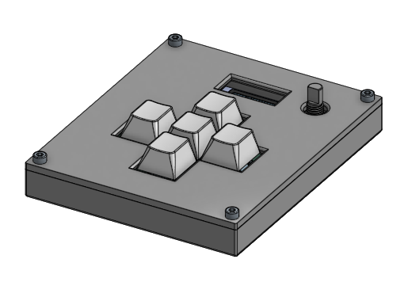

# macropad

> ![TODO] This README is a work in progress.

A custom macropad designed by me.

## BOM

> This is not finished. It needs to be in a table format.

- Case
- PCB
- MCU (XIAO RP2040)
- OLED
- 5x buttons
    - switches
    - keycaps
- Rotary Encoder
- 4x screws from the kit

## README Ideas

- 3D viewer?
- Images... duh
    - Consider using tables for images... kind of like carousels.
- Maybe a more readable BOM / list of features