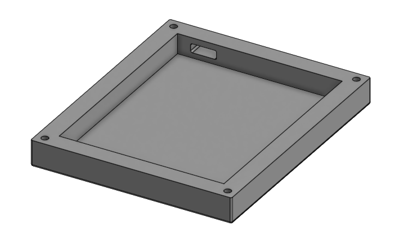
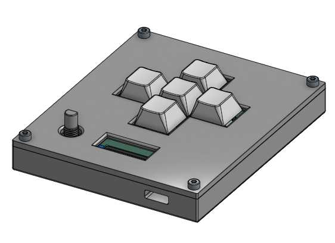

# macropad

A custom macropad designed by me.

## BOM

| Qty | Item            | Source | Details                                                |
| --- | --------------- | ------ | ------------------------------------------------------ |
| 1   | Case            |        | The case is two seperate parts. It will be 3D printed. |
| 1   | PCB             |        | Designed using KiCad.                                  |
| 1   | Microcontroller | Kit    | Using the Seeed XIAO RP2040                            |
| 1   | OLED Display    | Kit    | 0.91"                                                  |
| 5   | Switch          | Kit    | "MX-style"                                             |
| 5   | Keycaps         | Kit    | Blank white DSA keycaps                                |
| 1   | Rotary Encoder  | Kit    | EC11, Alps                                             |
| 4   | Screws          | Kit    | M3x16mm                                                |

## Components

### Case

The case was designed using [onshape](https://onshape.com/).

It is seperated into two pieces: 

#### Case Top

The top piece has holes for the buttons, OLED screen, rotary encoder, and the screws to attach it to the bottom part.

#### Case Bottom

The bottom part of the case is composed of a baseplate and four walls that are on top of it. The four corners of the walls have holes for screws meant to attach the top part of the case. The wall nearest to the MCU has a hole for the USB-C connector so that it can be accessed easily.

### PCB

The PCB was designed with [KiCad](https://www.kicad.org/), an open-source electronics design software. 

The design of the PCB started with a schematic that dictates which components must be connected to each other:

After this schematic was completed, the traces on the PCB had to be drawn. Here is what the final result looks like:

